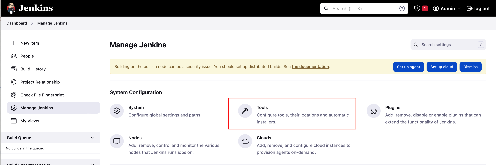
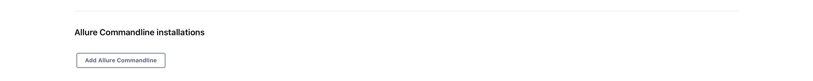
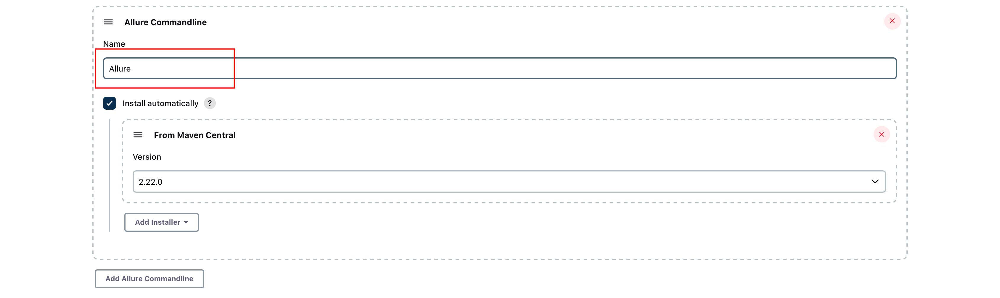

# SAAO Shared Jenkins Library

This shared library contains various functions (steps) which you can use in Jenkins pipelines for SAAO projects.

## Dependencies

### Docker

Docker must be installed on your machine, and it must be in the `PATH` used by the Jenkins server.

If you install Jenkins with Homebrew on macOS, you thus have to modify the file `/usr/local/Cellar/jenkins/NNN/homebrew.mxcl.jenkins.plist` (where `NNN` is the version number of Jenkins), adding the following lines.

```
<key>EnvironmentVariables</key>
<dict>
<key>PATH</key>
<string>/usr/local/bin:/usr/bin:/bin:/usr/sbin:/sbin:/Applications/Docker.app/Contents/Resources/bin/:/Users/XXX/Library/Group\ Containers/group.com.docker/Applications/Docker.app/Contents/Resources/bin</string>
</dict>
```

Here `XXX` denotes your username. Afterwards you need to restart Jenkins.

```shell
brew services restart jenkins 
```

### Plugins

In addition to the recommended plugins installed when first starting Jenkins the following plugins are required.

* [Docker Pipeline](https://plugins.jenkins.io/docker-workflow/) (Note this is not the same as the "Docker" plugin.)
* [SSH Pipeline Steps](https://plugins.jenkins.io/ssh-steps/)
* [Allure](https://plugins.jenkins.io/allure-jenkins-plugin/)
* [Warnings Next Generation](https://plugins.jenkins.io/warnings-ng/)

### Allure

In order to use the Allure plugin, you also have to install the [Allure Framework](https://docs.qameta.io/allure/). To do so, first go to the Jenkins dashboard and select the "Manage Jenkins" item from the sidebar menu.


Then select the "Tools" option.



Scroll down to the "Allure commandline installations" section and click oon the "Add Allure Commandline" button.



Add a name and leave the other settings unchanged.



Save the settings by clicking on the Save button at the bottom of the page.

#### An important caveat

Allure cannot run on a Docker agent. So if you use the `generatePythonTestReports` step (or use the `allure` step directly), you must ensure this is done on a "normal" agent.

### Other requirements

Some of the steps require software like Python. The easiest way to accommodate such requirements is to run your pipeline by a Docker agent specified by a Dockerfile provided along with your project. This will be explained in more detail when discussing the `saaoRunPythonTests` function below.

## Installation

You first have to configure Jenkins to use the library. Go to the Jenkins dashboard and select the "Manage Jenkins" option from the sidebar menu.


Select the "System" option.


The system configuration page is quite long, but if you scroll down, you will eventually find the section for adding global pipeline libraries.


Click on the Add button and configure the library as follows.

* Choose `saao-shared-library` as the name.
* Use `main` as the default version.
* Choose [https://github.com/saltastroops/saao-shared-jenkins-library.git](https://github.com/saltastroops/saao-shared-jenkins-library.git) as the project repository.
* Leave the other settings unchanged.

The screenshots below highlight the settings you have to change.


Finally, click the Save button at the bottom of the page to save your changes.

The library is now available. However, to make its pipeline syntax documentation more readable, you need to enable HTML formatting. To do so, click on the Manage Jenkins link in the breadcrumbs at the top of the page and select the Configure Global Security option.


Scroll down to the Markup Formatter section and select Safe HTML as the formatter option.


Remember to click the Save button at the bottom of the page to save your changes.

## Using the library

Once you have installed the library, you can use it in any of your pipelines by importing it at the top of the pipeline script and then calling its functions.

In case you are using a declarative pipeline, you need to call the functions within a `script` block.

## Viewing the documentation

For convenience, documentation about the library's steps is provided in Jenkins' pipeline syntax documentation. To access it, select the Pipeline Syntax item from the sidebar menu of your pipeline page.


Then choose the Global Variables Reference item from the sidebar menu.


You can now scroll to the `saao` section to view the documentation.

## Generating test reports

### Allure

By default, `runPythonTests` creates the necessary files for an Allure report whenever it runs `pytest`. (You can disable this by passing the `allure` argument with the value `false`.)

The report files are created in a folder `reports` in the workspace. If you require a different folder, you can specify it with the `reportsDir` argument. 

However, `runPythonTests` does *not* generate the actual report. For this you need to call the `generatePythonTestReports` function or directly include an `allure` step in your pipeline.

### Warnings Next Generation

By default, `runPythonTests` creates the necessary files for Warnings Next Generation reports whenever it runs `flake8` or `mypy`. (You can disable this by passing the `flake8` or `mypy` argument with the value `false`.)

The report files are created in a folder `reports` in the workspace. If you require a different folder, you can specify it with the `reportsDir` argument.

However, `runPythonTests` does *not* generate the actual reports. For this you need to call the `generatePythonTestReports` function or directly include a `recordIssues` step in your pipeline.

## Available steps

### saao.runPythonTests

This function can be used to run the following Python tools for testing:

* bandit
* black
* flake8
* isort
* mypy
* pytest

It requires Python and the various tools to be available on the agent on which the job is run. The best way to ensure this is to use a Docker agent with a Dockerfile supplied by your project.

For example, assume your project contains a file `jenkins/agent/Dockerfile` with the following content.

```dockerfile
FROM python:3.10 AS requirements

RUN apt-get update -y

RUN curl -sSL https://install.python-poetry.org | POETRY_HOME=/usr/local python3 -

RUN pip install wheel
RUN pip install allure-pytest bandit black flake8 isort mypy pytest
```

This file installs Python 3.10 and all the required libraries. It also installs Poetry, which is *not* required for `runPythonTests` but might be used by your project.

Then a pipeline script for running Python tests might look as follows.

```groovy
@Library('saao-shared-library') _

pipeline {
  agent {
    dockerfile {
      filename 'Dockerfile'
      dir 'jenkins/dev-deployment'
      args '-v finder-chart-generator-venv:/venv -u 0:0'
    }
  }

  stages {
    stage("Run tests") {
      steps {
        sh 'echo $PATH'
        sh 'poetry export -f requirements.txt --with dev --output requirements.txt'
        saaoRunPythonTests()
      }
    }
  }
}
```

The `args` string passed to `dockerfile` adds a Docker volume for caching the installed Python libraries, significantly speeding up the pipeline execution time. Also, it makes sure that the script is run as the root user, avoiding permission issues.

`runPythonTests` takes several arguments for configuring the paths to check.

| Argument | Required? | Explanation                 | Example value      |
|----------|-----------|-----------------------------|--------------------|
| bandit   | No        | Paths to check with bandit. | `['src']`          |
| black    | No        | Paths to check with black.  | `['src', 'tests']` |
| flake8   | No        | Paths to check with flake8. | `['src', 'tests']` |
| isort    | No        | Paths to check with isort.  | `['src', 'tests']` |
| mypy     | No        | Paths to check with mypy.   | `['src', 'tests']` |
| pytest   | No        | Paths to check with pytest. | `['tests']`        |

A check is only performed if the corresponding argument is included and its value is not an empty list.

By default `saaoRunPythonTests` generates the necessary files for Allure in a folder `reports/allure` whenever it runs pytest, and the necessary files for Warnings Next Generation in a folder `reports/warnings-next-generation` whenever it runs flake8 or mypy. You may configure this by passing the following arguments.

| Argument               | Required? | Explanation                                                                           | Example value         |
|------------------------|-----------|---------------------------------------------------------------------------------------|-----------------------|
| allure                 | No        | Whether to generate report files for Allure. The default is `true`.                   | `false`               |
| reportsDir             | No        | The folder in which to put the created report files. The default is `'reports'`.      | `'generated-reports'` |
| warningsNextGeneration | No        | Whether to generate report files for Warnings Next Generation. The default is `true`. | `false`               |

As an example, the following call runs black and mypy on the `src` and `tests` folder and pytest on the `tests` folder, but runs no other tools. It creates report files for Allure, but no files for Warnings Next Generation.

```groovy
saao.runPythonTests 'black': ['src', 'tests'], 'flake8': ['src', 'tests'], 'pytest': ['tests'], 'warningsNextGeneration': false
```

While `runPythonTests` creates the necessary files, it does not generate the actual reports. However, in most cases you can generate the reports by just using the `generatePythonTestReports` step inside a `script` step. Note that you cannot do this on a Docker agent as Allure won't work on such an agent.

Alternatively, you can manually use the `allure` and `raiseIssues` steps. If you do this on a different agent from the one where you ran the tests, you need to stash the report-related files by means of the ` stash` step. For example:

```
stash includes: 'reports/**', name: 'reports'
```

You then have to unstash the files on the agent where you are generating the reports.

```
unstash 'reports'
```

`runPythonTests` returns `true` if all checks pass, and `false` otherwise. If you need to know which particular checks have failed, you have to make individual calls for the tools. For example:

```groovy
saaoRunPythonTests 'black': ['src', 'tests']
saaoRunPythonTests 'pytest': ['tests']
```

### generatePythonTestReports

This is a convenience step for generating the Allure and Warnings Next Generation reports. You can only execute this step after the `runPythoinTests` step. These two steps may be run on different agents.

`generatePythonTestReports` takes no arguments.

### deployContainer

This step builds an image of the current directory, pushes the image to a registry and deploys a container to a server. More precisely, the following steps are carried out.

1. An image is built using the Dockerfile in the root directory of the workspace.
2. The image is tagged with the short hashcode of the git head.
3. The image is pushed to a container registry.
4. On the deployment server, the image just pushed is pulled.
5. Still on the deployment server, docker compose is used to restart the services.
6. Finally, the docker images on the deployment server are pruned.

Various requirements must be met for this step.

* The public SSH key of the Jenkins user must be included in the `authorized_keys` file of the user on the deployment server.
* The username for the deployment server and the private SSH _of the Jenkins user_ must be stored as credentials of the type "SSH username with private key".
* The username and password for the container registry must be stored as credentials of the type "Username with password".
* The docker compose file must only define a single service, and that service must use the deployed image. The registry, image name and image tag should not be given explicitly, but in form of environment variables `$REGISTRY`, `$IMAGE_NAME` and `$TAG`.
* Apart from standard plugins, the [SSH Pipeline Steps](https://plugins.jenkins.io/ssh-steps/) must be installed.

The following is an example of what the docker compose file might look like.

```yaml
services:
  fcg:
    image: ${REGISTRY}/${REGISTRY_USERNAME}/${IMAGE_NAME}:${TAG}
    ports:
      - 6789:8000
    restart: always
```

`saaoDeployContainer` takes several arguments (as a map).

| Argument              | Required? | Explanation                                                                                                                                                                        | Example value                   |
|-----------------------|-----------|------------------------------------------------------------------------------------------------------------------------------------------------------------------------------------|---------------------------------|
| dockerComposeFile     | No        | Path of the docker compose file to use for dseploying.                                                                                                                             | docker-compose.yml              |
| dockerFile            | No        | Path of the Dockerfile to use for building the image.                                                                                                                              | Dockerfile                      |
| host                  | Yes       | Address of the deployment server.                                                                                                                                                  | dev.example.com                 |
| hostCredentialsId     | Yes       | Identifier of the credentials for the username on the deployment server and the private SSH key of the Jenkins user.                                                               | dev-server-credentials          |
| imageName             | Yes       | Name of the Docker image to deploy. This name is also used as the name of the deployment directory (on the deployment server), which will be created in the user's home directory. | my-great-webapp                 |
| registryCredentialsId | Yes       | Identifier of the credentials for the container registry username and password.                                                                                                    | registry-credentials            |
| registryUrl           | Yes       | URL of the container registry.                                                                                                                                                     | https://registry.example.com    |
| secretFiles           | No        | Map of credentials identifiers and file paths, as explained below. If a file path contains a directory, that directory must exist on the host already.                             | ['my-great-webapp-env': '.env'] |

The credentials identifier is the ID you provide when creating new credentials, as highlighted in the following screenshot.


If your docker compose files requires (secret) configuration files, most likely a `.env` file, you should add these as credentials of type "Secret file" to Jenkins. You can then pass a map of these identifiers and host file paths as the `secretFiles` argument. The file paths refer to the locations to where the file should be copied, and they are given relative to the project's directory on the host.

For example, if the `imageName` argument is `my-great-webapp` and the `secretFiles` argument is `['mgw-1': '.env', 'mgw-2': 'a/.env2']`, the files `~/my-great-webapp/.env` and `~/my-great-webapp/a/.env2` will be created on the deployment host. Note that in this case the directory `~/a` must already exist when the pipeline is run.
