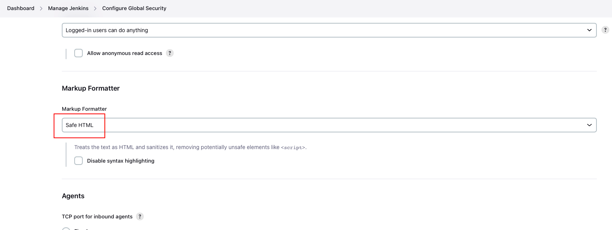

# SAAO Shared Jenkins Library

This shared library contains various global variables (steps) which you can use in Jenkins pipelines for SAAO projects.

## Dependencies

This library has several dependencies.

### Docker

Docker must be installed on your machine, and it must be in the `PATH` used by the Jenkins server.

If you install Jenkins with Homebrew on macOS, you thus have to modify the file `/usr/local/Cellar/jenkins/NNN/homebrew.mxcl.jenkins.plist` (where `NNN` is the version number of Jenkins), adding the following lines.

```
<key>EnvironmentVariables</key>
<dict>
<key>PATH</key>
<string>/usr/local/bin:/usr/bin:/bin:/usr/sbin:/sbin:/Applications/Docker.app/Contents/Resources/bin/:/Users/XXX/Library/Group\ Containers/group.com.docker/Applications/Docker.app/Contents/Resources/bin</string>
</dict>
```

Here `XXX` denotes your username. Afterwards you need to restart Jenkins.

```shell
brew services restart jenkins 
```

### Plugins

In addition to the recommended plugins installed when first starting Jenkins the following plugins are required.

* [Docker Pipeline](https://plugins.jenkins.io/docker-workflow/) (Note this is not the same as the "Docker" plugin.)
* [SSH Pipeline Steps](https://plugins.jenkins.io/ssh-steps/)

### Other requirements

Some of the functions may require software like Python. The easiest way to accommodate such requirements by running your pipeline by a Docker agent specified by a Dockerfile provided along with your project. This will be explained in more detail when discussing the `saaoRunPythonTests` function below.

## Installation

You first have to configure Jenkins to use the library. Go to the Jenkins dashboard and select the "Manage Jenkins" option from the sidebar menu.


Select the "System" option.


The system configuration page is quite long, but if you scroll down, you will eventually find the section for adding global pipeline libraries.


Click on the Add button and define the library details as shown below. Configure the library as follows.

* Choose `saao-shared-library` as the name.
* Use `main` as the default version.
* Choose [https://github.com/saltastroops/saao-shared-jenkins-library.git](https://github.com/saltastroops/saao-shared-jenkins-library.git) as the project repository.
* Leave the other settings unchanged.

The screenshots below highlight the settings you have to change.


Finally, Click the Save button at the bottom of the page to save your changes.

The library is now available. However, to make the documentation more readable, you need to enable HTML formatting. To do so, click on the Manage Jenkins link in the breadcrumbs at the top of the page and select the Configure Global Security option.


Scroll down to the Markup Formatter section and select Safe HTML as the formatter option.



Remember to click the Save button at the bottom of the page to save your changes.

## Using the library

Once you have installed the library, you can use it in any of your pipelines by importing it at the top of the pipeline script and then calling its functions, as shown in the following example.

## Viewing the documentation

For convenience, documentation about the .library functions is provided in Jenkins' pipeline syntax documentation. To access it, select the Pipeline Syntax item from the sidebar menu of your pipeline page.


Then choose the Global Variables Reference item from the sidebar menu.


You can now scroll to the documentation for the function you need.

## Available functions

### `saaoRunPythonTests`

This function can be used to run the following Python tools for testing:

* bandit
* black
* flake8
* isort
* mypy
* pytest

It requires Python and the various tools to be available on the agent on which the job is run. The best way to ensure this is run a Docker agent with a Dockerfile supplied by your project.

For example, assume your project contains a file `jenkins/agent/Dockerfile` with the following content.

```dockerfile
FROM python:3.10 AS requirements

RUN apt-get update -y

RUN curl -sSL https://install.python-poetry.org | POETRY_HOME=/usr/local python3 -

RUN pip install wheel
RUN pip install bandit black flake8 isort mypy
```

This file installs Python 3.10 and all the required libraries. It also installs Poetry, which is *not* required for `saaoRunPythonTests` but might be used by your project.

Then a pipeline script for running Python tests might look as follows.

```groovy
@Library('saao-shared-library@run-python-tests') _

pipeline {
  agent {
    dockerfile {
      filename 'Dockerfile'
      dir 'jenkins/dev-deployment'
      args '-v finder-chart-generator-venv:/venv -u 0:0'
    }
  }

  stages {
    stage("Run tests") {
      steps {
        sh 'echo $PATH'
        sh 'poetry export -f requirements.txt --with dev --output requirements.txt'
        saaoRunPythonTests()
      }
    }
```

The `args` string passed to `dockerfile` adds a Docker volume for caching the installed Python libraries, significantly speeding up the pipeline execution time. Also, it makes sure that the script is run as the root user, avoiding permission issues.

`saaoRunPythonTests` takes several arguments (as a map).

| Argument | Required? | Explanation                 | Example value     |
|----------|---|-----------------------------|-------------------|
| bandit   | No | Paths to check with bandit. | `['src']`         |
| black    | No | Paths to check with black.  | `['src', 'tests']`         |
| flake8   | No | Paths to check with flake8. | `['src', 'tests']`         |
| isort    | No | Paths to check with isort.  | `['src', 'tests']`         |
| mypy     | No | Paths to check with mypy.   | `['src', 'tests']` |
| pytest   | No | Paths to check with pytest. | `['tests']`       |

A check is only performed if the corresponding argument is included and its value is not an empty list. For example, the following call would run black on the `src` and `tests` folder and pytest on the `tests` folder, but would run no other tools.

```groovy
saaoRunPythonTests 'black': ['src', 'tests'], 'pytest': ['tests']
```

### `saaoDeployContainer`

This function builds an image of the current directory, pushes the image to a registry and deploys a container to a server. More precisely, the following steps are carried out by the function.

1. An image is built using the Dockerfile in the root directory of the workspace.
2. The image is tagged with the short hashcode of the git head.
3. The image is pushed to a container registry.
4. On the deployment server, the image just pushed is pulled.
5. Still on the deployment server, docker compose is used to restart the services.
6. Finally, the docker images on the deployment server are pruned.

Various requirements must be met for this function.

* The public SSH key of the Jenkins user must be included in the `authorized_keys` file of the user on the deployment server.
* The username for the deployment server and the private SSH _of the Jenkins user_ must be stored as credentials of the type "SSH username with private key".
* The username and password for the container registry must be stored as credentials of the type "Username with password".
* The docker compose file must only define a single service, and that service must use the deployed image. The registry, image name and image tag should not be given explicitly, but in form of environment variables `$REGISTRY`, `$IMAGE_NAME` and `$TAG`.
* Apart from standard plugins, the [SSH Pipeline Steps](https://plugins.jenkins.io/ssh-steps/) must be installed.

The following is an example of what the docker compose file might look like.

```yaml
services:
  fcg:
    image: ${REGISTRY}/${REGISTRY_USERNAME}/${IMAGE_NAME}:${TAG}
    ports:
      - 6789:8000
    restart: always
```

`saaoDeployContainer` takes several arguments (as a map).

| Argument             | Required?                                                                                                                                                                             | Explanation                                                                                                                                                                        | Example value                   |
|--------|------------------------------------------------------------------------------------------------------------------------------------------------------------------------------------|------------------------------------------------------------------------------------------------------------------------------------------------------------------------------------|---------------------------------|
| host                 | Yes | Address of the deployment server.                                                                                                                                                  | dev.example.com                 |
| hostCredentialsId    | Yes | Identifier of the credentials for the username on the deployment server and the private SSH key of the Jenkins user.                                                               | dev-server-credentials         |
| imageName         | Yes   | Name of the Docker image to deploy. This name is also used as the name of the deployment directory (on the deployment server), which will be created in the user's home directory. | my-great-webapp                 |
| registryCredentialsId | Yes | Identifier of the credentials for the container registry username and password.                                                                                                    | registry-credentials |
| registryUrl     | Yes     | URL of the container registry.                                                                                                                                                     | https://registry.example.com    |
| secretFiles     | No     | Map of credentials identifiers and file paths, as explained below. If a file path contains a directory, that directory must exist on the host already.                             | ['my-great-webapp-env': '.env'] |

The credentials identifier is the ID you provide when creating new credentials, as highlighted in the following screenshot.


If your docker compose files requires (secret) configuration files, most likely a `.ewnv` file, you should add these as credentials of type "Secret file" to Jenkins. You can then pass a map of these identifiers and host file paths as the `secretFiles` argument. The file paths refer to the locations to where the file should be copied, and they are given relative to the project's directory on the host.

For example, if the `imageName` argument is `my-great-webapp` and the `secretFiles` argument is `['mgw-1': '.env', 'mgw-2': 'a/.env2']`, the files `~/.env` and `~/a/.env2` will be created on the deployment host. Note that in this case the directory `~/a` must already exist when the pipeline is run.
